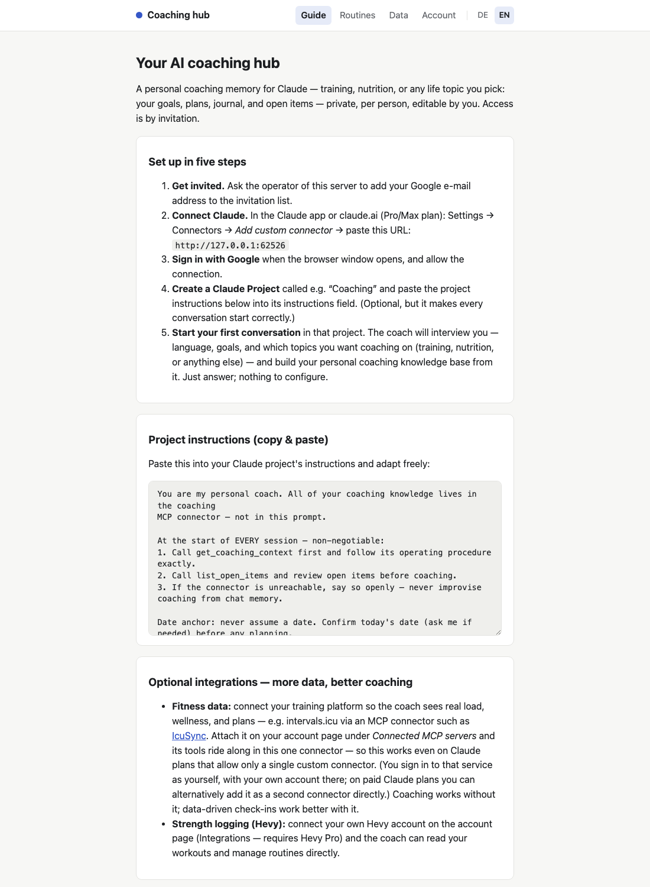
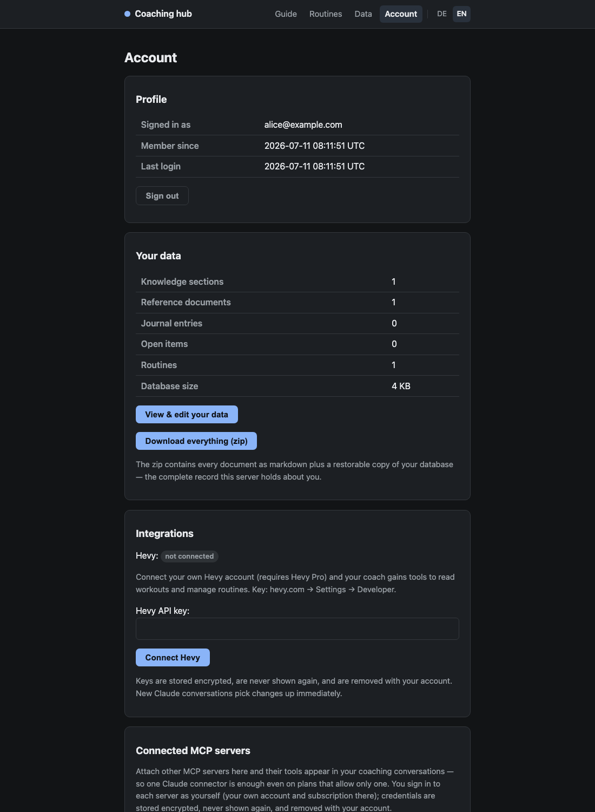
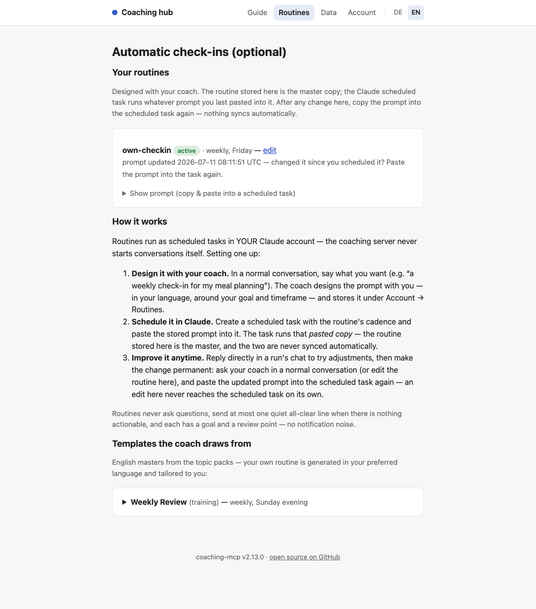
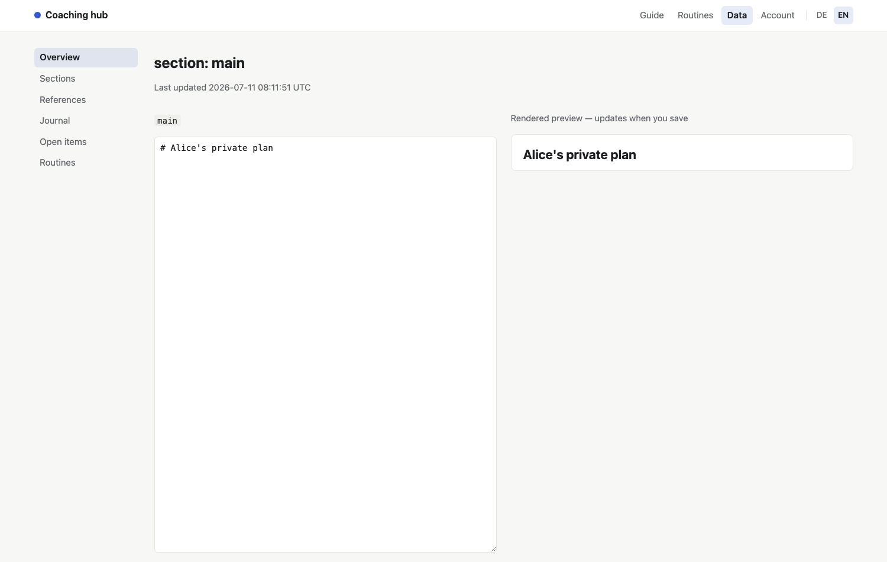

# coaching-mcp

[](https://github.com/OliverKrr/coaching-mcp/releases)
[](LICENSE)


Multi-user coaching MCP server for Claude AI, backed by SQLite + FTS5. Serves a `SKILL.md`
coaching knowledge base with full-text search, reference documents, a session journal, open
items, and stored scheduled routines — one isolated database per user, with a **built-in OAuth
2.1 authorization server** that federates login to an OIDC identity provider (Google by
default). Coaching is **topic-based**: the server ships installable topic packs (endurance
training, nutrition/meal planning, or any custom topic), and each user picks one or several
during a conversational onboarding. Users connect from their own Claude accounts via the
standard custom-connector flow; nobody handles tokens or secrets.

The same container serves a small human-facing site — setup guide, routines, and a full
self-service account area — server-rendered, bilingual (English/German), dark-mode aware, and
with **zero JavaScript** (`script-src 'none'`):

| The setup guide every user starts from                         | Self-service account page (dark mode)                             |
| -------------------------------------------------------------- | ----------------------------------------------------------------- |
|       |    |
| **Routines — designed in chat, run as Claude scheduled tasks** | **Every document editable in the browser**                        |
|                 |  |

```
Claude (per-user MCP connector, OAuth 2.1 + PKCE)
   │
   ▼
coaching-mcp serve (one container)
   ├── /mcp          Streamable HTTP MCP endpoint
   ├── /authorize …  built-in OAuth AS → OIDC login (e.g. Google) → membership check
   ├── /account      self-service page: export all data, delete account
   ├── /admin        operator page: approve registrations, quotas, users
   └── /data/users/<id>/skill.db   one coaching DB per user
```

## Tools

| Tool                                  | Description                                                                                                |
| ------------------------------------- | ---------------------------------------------------------------------------------------------------------- |
| `get_coaching_context`                | Returns the full `SKILL.md` content                                                                        |
| `search_knowledge`                    | FTS5 full-text search across sections, references, journal, and routines                                   |
| `get_section` / `list_sections`       | One knowledge section / all sections with metadata                                                         |
| `get_reference` / `list_references`   | One reference document / all references with metadata                                                      |
| `get_journal`                         | Returns recent journal entries newest-first                                                                |
| `update_section`                      | Upserts a knowledge section                                                                                |
| `update_reference`                    | Upserts a reference document                                                                               |
| `append_journal`                      | Appends a coaching journal entry                                                                           |
| `delete_section` / `delete_reference` | Deletes a document (confirm required; `main` protected)                                                    |
| `add_open_item`                       | Records a commitment (if-then next action) or a de-duplicated flag                                         |
| `list_open_items`                     | Lists open commitments/flags (defaults to status=open) — call at session start                             |
| `resolve_open_item`                   | Closes an open item (done/dismissed) with an optional note                                                 |
| `list_topic_packs`                    | Lists installable coaching topics (training, nutrition, custom, …)                                         |
| `get_topic_pack`                      | Full pack: interview, section/reference skeletons, routine templates                                       |
| `list_routines` / `get_routine`       | The user's stored scheduled-routine prompts                                                                |
| `save_routine`                        | Upserts a routine (name, cadence, prompt, status) designed with the user                                   |
| `delete_routine`                      | Deletes a stored routine (confirm required)                                                                |
| `request_quota_increase`              | Asks the operator for more storage, with a reason (multi-user mode)                                        |
| `notify_user`                         | Sends the user a Telegram message — e.g. a routine's check-in summary (only for users who linked Telegram) |
| `get_version`                         | Build info + per-table statistics incl. storage usage vs. quota                                            |

## Quick start (multi-user, Docker Compose)

```yaml
services:
  coaching_mcp:
    build: . # or: image: ghcr.io/oliverkrr/coaching-mcp:main
    ports:
      - "8000:8000"
    environment:
      PUBLIC_URL: "https://coaching.example.com" # external URL (may include a path prefix)
      OIDC_CLIENT_ID: "${OIDC_CLIENT_ID}"
      OIDC_CLIENT_SECRET: "${OIDC_CLIENT_SECRET}"
      ADMIN_EMAILS: "you@example.com" # always allowed; other users self-register
    volumes:
      - coaching_data:/data

volumes:
  coaching_data:
```

Then each user adds `https://coaching.example.com` as a custom connector in Claude
(Settings → Connectors → Add custom connector) and signs in with the identity provider. Admins
are in immediately; everyone else lands as a pending request the admin approves (see "Who can
log in"). A user's database is created on first successful login, seeded from the built-in
template (below).

### Identity provider setup (Google example)

1. Google Cloud Console → APIs & Services → OAuth consent screen: External, publish (only the
   `openid email profile` scopes are used — no verification review needed).
2. Credentials → Create OAuth client ID → Web application → authorized redirect URI:
   `<PUBLIC_URL>/oidc/callback`.
3. Put the client id/secret into `OIDC_CLIENT_ID` / `OIDC_CLIENT_SECRET`.

Any OIDC-discoverable issuer works — set `OIDC_ISSUER` to override the Google default.

### Who can log in

Authentication proves identity; **membership** decides access — and it lives in the server's own
database, managed at runtime:

- **Admins** (`ADMIN_EMAILS`, comma-separated) are always allowed and get the `/admin` page:
  pending access requests, quota requests, and the user list with disable/enable/delete and
  per-user quota controls.
- **Self-registration** (default): any verified login that isn't known yet becomes a _pending
  request_ — the visitor sees a "request received" page, the operator gets a notification (see
  below) and approves or rejects on `/admin` or straight from Telegram. Nothing is provisioned
  until approval. Set `REGISTRATION=closed` to turn this off.
- **Bootstrap allowlist** (optional): addresses in `ALLOWED_EMAILS` and/or an
  `ALLOWED_EMAILS_FILE` (one per line, `#` comments, hot-reloaded) skip the approval step —
  useful for seeding a deployment and as lockout recovery.

Rejected or disabled users get a neutral denial page; disabling revokes all tokens immediately.

### Operator notifications (optional)

Two channels, both best-effort and independent:

- **Telegram** (`TELEGRAM_BOT_TOKEN` + `TELEGRAM_ADMIN_CHAT_ID`): signup and quota requests
  arrive as bot messages with inline **Approve/Reject/Grant** buttons — routine admin actions
  happen from chat, and the edited message doubles as an audit trail. The server registers its
  webhook itself on boot (`<PUBLIC_URL>/telegram/webhook`, secret-token verified; actions are
  additionally restricted to the admin chat id). Create the bot with @BotFather; the chat id is
  in `getUpdates` after you message the bot once.
- **Plain webhook** (`NOTIFY_URL`): fire-and-forget text `POST` per event — works with any
  push service or chat incoming webhook. Send-only.

### User-side Telegram (opt-in, per user)

Users may connect the same bot via a `t.me` deep link on the pending page and on `/account`
(bots cannot message anyone who hasn't started them, so this is strictly opt-in; disconnect
anytime). Once linked, three things work:

- **Notifications**: approval and quota changes reach them as push messages.
- **Coach pushes**: their sessions gain a `notify_user` tool, so a scheduled routine run can
  deliver its final check-in or summary straight to the phone (budgeted per user per day). The
  seeded coaching-method reference tells the assistant to mirror routine pushes there when the
  tool is present.
- **Quick capture**: any plain text they send the bot is appended to their coaching journal as
  `[via Telegram] …` (LLM-free, quota-checked, rate-limited) — the coach reads it at the next
  session start.

### Storage quotas

Each user gets a storage quota (default 50 MB of stored content — generous for coaching
knowledge, hard against misuse as free file storage). Per-document caps: 1 MB per
section/reference, 64 KB per journal entry/routine/open item; writes are also budgeted at
60/min per user. The connected assistant sees the quota: write responses and the session-start
context carry a warning from 80% usage, `get_version` reports usage, an over-quota write returns
a self-describing error, and the `request_quota_increase` tool lets the assistant ask the
operator for more (with a reason) — grantable from Telegram or `/admin`. Admins can set
per-user quotas anytime; `QUOTA_DEFAULT_MB` changes the default.

### Reverse proxies / path prefixes

`PUBLIC_URL` may include a path prefix (e.g. `https://example.com/coaching`). The server mounts
its routes at `/` and builds all advertised URLs from `PUBLIC_URL`, so put it behind a
prefix-stripping proxy location and everything (metadata discovery, OIDC callback, account page)
lines up. RFC 8414 suffixed discovery paths (`/.well-known/oauth-authorization-server/<suffix>`)
are handled.

## Account page — view, edit, export & delete

`<PUBLIC_URL>/account` lets every user self-serve their data rights:

- **View & edit** (`/account/data`): browse every document the server stores — knowledge
  sections, reference documents, journal entries, open items, stored routines — and edit them
  directly in the browser: fix a section the assistant got wrong, create or delete documents
  (the `main` SKILL.md section is edit-only), correct or remove journal entries, change an open
  item's content or status, copy a routine prompt into a Claude scheduled task.
  Section/reference/routine saves are guarded by an optimistic-concurrency check, so a save
  never silently overwrites a change a coaching session made in the meantime.
- **Export**: one click downloads a zip with every document as markdown (`SKILL.md`,
  `sections/`, `references/`, `journal.md`, `open-items.md`, `routines.md`,
  `seed-manifest.json`) plus a restorable binary copy of their `skill.db`.
- **Delete account**: type-your-email confirmation, then the user's database directory is
  removed and all tokens revoked — immediate and irreversible on the server. Operator backups
  expire on the deployment's own retention schedule.

Privacy baseline: user isolation is structural (one SQLite file per user; the tool layer only
ever sees a DB handle), logs carry user ids and event names but never content, and no per-user
password exists anywhere — identity comes from the IdP, authorization from the membership state.

## Integrations (optional, per user)

With `SECRETS_KEY` set, each user can connect third-party services on their account page —
currently **Hevy** (strength logging; requires the user's own Hevy Pro API key). Keys are
validated live before being stored, sealed with AES-256-GCM under the server master key (a
leaked database alone yields nothing; the AAD binds every ciphertext to its user), never
rendered back, and removed with the account. Users with a stored key get the full Hevy API
surface as `hevy_*` MCP tools in their coaching sessions — workouts (list/get/count/events,
create, update), routines (list/get, create, update), exercise templates (search across the
whole catalog, list/get, create custom, per-exercise history), routine folders (list/get,
create), body measurements (list/get, create, update), and account info. Users without a key
see no Hevy tools at all. If Hevy later rejects the key, tools answer with plain guidance to
update it on the account page.

## Connected MCP servers — the per-user gateway

Free-plan Claude accounts allow only **one** custom MCP connector. So each user can attach
further MCP servers on their account page ("Connected MCP servers"), and their coaching
sessions mount those servers' tools alongside the native ones — one connector carries
everything. Requires `SECRETS_KEY`.

- **Verbatim schemas, attributed names.** Upstream input schemas, annotations, and server
  instructions reach the assistant untouched — a curated upstream (rich per-endpoint guidance)
  keeps its full value. Tool names carry a mandatory per-server prefix (derived from the
  server's name unless set explicitly; unique per user), and descriptions/titles are prepended
  with the server name — so in tool lists and permission dialogs every tool is traceable to its
  server, and similar names from different servers can never be confused. The session
  instructions tell the assistant about each prefix, so upstream docs referencing original
  names still resolve.
- **Own account, own credentials.** OAuth upstreams get the standard dance (discovery, dynamic
  client registration, PKCE) started from the account page — the user authorizes with their own
  account and subscription there; static-token upstreams take a pasted token; URLs with an
  embedded access token (`…/mcp?token=…`) work as pasted — the query part is split off, sealed
  like any other credential, and re-attached only at connect time (the visible URL and logs
  never contain it). Credentials are sealed in the per-user secret store and removed with the
  account. This is a convenience
  gateway, not a way around an upstream's pricing: each user still needs their own access to
  the upstream service.
- **Failure-tolerant.** An unreachable or unauthorized upstream is skipped for that session and
  its status (with "Reconnect") shows on the account page — coaching never breaks.
- **SSRF-guarded.** Gateway URLs must be https and must not resolve to private/internal
  addresses (checked at save time and on every request, including redirects). DNS-rebinding is
  neutralized by TLS: internal services cannot present a valid certificate for a hostile name.
  Caps: 5 servers per user, 200 mounted tools per session.

## Protected apps (operator)

`PROTECTED_APPS="name=http://host:port,…"` serves internal web tools at `/apps/<name>/` behind
the same Google login — with a **per-app email allowlist**
(`PROTECTED_APP_<NAME>_EMAILS`), because login alone must not expose personal dashboards to
every coached user. HTML responses get root-absolute references (`href/src/action/hx-*`),
`Location` headers, and cookie paths rewritten onto the prefix so small dashboards work
unmodified; other content streams through untouched. Authorized users see their tools linked on
the account page. WebSockets are not supported.

## Security posture

Per-user isolation is structural (one SQLite file per user; per-session MCP servers; tools never
see identity). All HTML pages ship a strict CSP (`script-src 'none'` — the pages contain no
JavaScript at all), `X-Frame-Options: DENY`, and `Referrer-Policy: no-referrer`. OAuth tokens
and codes are stored hashed; refresh tokens rotate with reuse-theft revocation; user secrets are
encrypted at rest; the auth endpoints are rate-limited per client IP. Logs carry ids and events,
never content or secrets.

## Default seed template & topic packs

If you don't mount your own seed data, the image ships a generic coaching template
(`seed-template/` in this repo, baked into `/seed`): a topic-agnostic core `SKILL.md`
(session-start protocol, snapshot, tiered auto-update policy, weekly review, routines) as
`[placeholder]`-marked skeletons, plus core reference stubs (`coaching-method`,
`routine-design`, `lifestyle`, `patterns`).

The template's first section is a **staged onboarding interview**: on the first conversation,
the connected assistant interviews the person (language, identity, coaching preference), then
offers the server's **topic packs** via `list_topic_packs` and instantiates each chosen topic —
its own interview, reference skeletons, and section skeleton, written through the normal MCP
write tools. So a brand-new user goes from empty database to a personalized, multi-topic
coaching setup in one conversation — no files to edit — and can add further topics in any later
session.

Shipped packs: **training** (endurance & strength: thresholds, zones, workout construction,
season planning + 7 references + 3 routine templates), **nutrition** (restriction-safe meal
coaching: dietary profile, recipes, meal planning + a weekly meal-planning routine), and
**custom** (a define-any-topic interview).

For the client side, `docs/project-instructions-template.md` has a small Claude-project
instructions template that bootstraps the assistant into this server at session start.

### Seed directory layout

```
seed/
├── SKILL.md          # Required — primary coaching context, loaded as section 'main'
├── references/       # Optional — core references, seeded for every new user
│   └── …
└── topics/           # Optional — topic packs, delivered on demand via MCP (not auto-seeded)
    └── <id>/
        ├── topic.md          # title, description, interview, section skeleton
        ├── references/*.md   # reference skeletons the assistant instantiates
        └── routines/*.md     # routine templates (`# Title` + `Cadence:` + prompt)
```

Each new user's database is seeded once, at first login. After that, all writes go through the
MCP tools. Operators can add or replace topic packs by mounting their own `/seed` — no code
change needed.

## Scheduled routines

Recurring check-ins (weekly review, meal planning, readiness checks) run as **scheduled tasks in
each user's own Claude account** — the server never initiates conversations. The assistant
designs a routine with the user (guided by the seeded `routine-design` reference: goal,
timeframe, cadence, silence conditions, review point), stores it via `save_routine` in the
user's language, and the user pastes the prompt into a Claude scheduled task — from the chat or
from `/account/data/routines`. Topic packs ship English master templates as raw material;
`<PUBLIC_URL>/routines` explains the flow and renders them.

## Environment variables (serve mode)

| Variable                      | Default                       | Description                                                                                               |
| ----------------------------- | ----------------------------- | --------------------------------------------------------------------------------------------------------- |
| `PUBLIC_URL`                  | — (required)                  | External base URL incl. any path prefix; OAuth issuer identity                                            |
| `OIDC_CLIENT_ID`              | — (required)                  | OAuth client registered at the identity provider                                                          |
| `OIDC_CLIENT_SECRET`          | — (required)                  | …and its secret                                                                                           |
| `OIDC_ISSUER`                 | `https://accounts.google.com` | Any OIDC-discoverable issuer                                                                              |
| `ADMIN_EMAILS`                | —                             | Comma-separated admins: implicitly allowed, gate `/admin`                                                 |
| `REGISTRATION`                | `open`                        | `closed` disables self-registration (invite-only mode)                                                    |
| `ALLOWED_EMAILS`              | —                             | Comma-separated bootstrap allowlist (skips approval)                                                      |
| `ALLOWED_EMAILS_FILE`         | —                             | Newline-separated allowlist file; merged, hot-reloaded                                                    |
| `TELEGRAM_BOT_TOKEN`          | —                             | Bot token (BotFather) — enables Telegram notifications + chat actions                                     |
| `TELEGRAM_ADMIN_CHAT_ID`      | —                             | Operator's chat id — the only chat allowed to drive membership actions                                    |
| `NOTIFY_URL`                  | —                             | Send-only webhook: plain-text POST per signup/quota request                                               |
| `QUOTA_DEFAULT_MB`            | `50`                          | Default per-user storage quota (admins can override per user)                                             |
| `DATA_DIR`                    | `/data`                       | auth.db + per-user DBs (persistent volume)                                                                |
| `SEED_DIR`                    | `/seed`                       | Seed template for new users                                                                               |
| `PORT`                        | `8000`                        | HTTP listen port                                                                                          |
| `ACCESS_TOKEN_TTL`            | `3600`                        | Access-token lifetime (seconds)                                                                           |
| `REFRESH_TOKEN_TTL`           | `7776000`                     | Refresh-token lifetime (seconds, rotated on use)                                                          |
| `SECRETS_KEY`                 | —                             | 32-byte base64 master key for per-user secrets (`openssl rand -base64 32`); unset → integrations disabled |
| `PROTECTED_APPS`              | —                             | `name=http://host:port,…` internal tools served at `/apps/<name>/` behind the login                       |
| `PROTECTED_APP_<NAME>_EMAILS` | —                             | Per-app email allowlist (required for anyone to reach the app)                                            |
| `HEVY_API_BASE`               | `https://api.hevyapp.com/v1`  | Hevy API base (override for tests)                                                                        |
| `GATEWAY_ALLOW_INSECURE`      | —                             | `1` relaxes the gateway SSRF policy (http + private hosts) — tests only, never production                 |

## Single-user stdio mode

The bare `coaching-mcp` command is the classic single-user stdio server (database at
`DATA_DIR/skill.db`, seeded once from `SEED_DIR`) — for local use or MCP clients that spawn a
subprocess. It needs none of the auth configuration.

## Snapshot & recovery

`coaching-mcp-snapshot` dumps a SQLite database to a local directory — a lossless,
WAL-safe binary copy for recovery plus human-readable markdown for inspection. It operates
on a **local DB file path** (in multi-user mode: `DATA_DIR/users/<id>/skill.db`); how you reach
the file (locally, `docker exec`, etc.) is up to your deployment.

```sh
just snapshot                 # → ./snapshots (gitignored)
just snapshot /path/to/out    # custom output dir
# or directly:
node dist/snapshot-cli.js ./snapshots --db /data/users/<id>/skill.db
```

Output (full mode):

| File                   | What                                                                                 |
| ---------------------- | ------------------------------------------------------------------------------------ |
| `skill.db`             | Lossless online backup — the recovery artifact (FTS, triggers, timestamps, journal). |
| `SKILL.md`             | The `main` knowledge section.                                                        |
| `sections/<name>.md`   | Other sections.                                                                      |
| `references/<name>.md` | Reference documents.                                                                 |
| `journal.md`           | All journal entries, newest first, with timestamps (inspection only).                |
| `open-items.md`        | All open items with kind/status (inspection only).                                   |
| `routines.md`          | All stored routines with cadence/status (inspection only).                           |

`--seed-only` emits just `SKILL.md` + `references/*.md` (the files the seed loader reads).

### Apply / restore (files → DB)

`coaching-mcp-restore` is the inverse of snapshot: it upserts the `sections` and `refs` tables
from a seed directory into a **live** DB. This is how edited seed files (`SKILL.md`,
`sections/*.md`, `references/*.md`) reach a DB that has already been seeded — `seedFromDirectory()`
only loads when the DB is empty, so editing seed files alone never updates a running DB.

```sh
node dist/restore-cli.js /seed --db /data/users/<id>/skill.db --dry-run  # preview only
node dist/restore-cli.js /seed --db /data/users/<id>/skill.db           # apply for real
```

It reads each seed file, compares it to the existing row, and upserts only when the content
actually differs (so `updated_at` is bumped only on real changes and the FTS index stays in
sync via triggers). The `journal` and `open_items` tables are never touched, so live coaching
history is preserved. A `seed-manifest.json` written by snapshot arms the **clobber guard**:
content changes where the live doc is newer than the manifest timestamp are conflicts that abort
the write unless `--force` is passed; `--dry-run` reports them as `STALE SEED` warnings.

**Recovery** (any deployment): stop the server, replace the target `skill.db` with the backed-up
copy (delete any `-wal`/`-shm` sidecars), start the server.

## Releases

Versions are tagged (`vX.Y.Z`) with notes on
[GitHub Releases](https://github.com/OliverKrr/coaching-mcp/releases). `just release X.Y.Z`
runs the whole sequence — version stamp, quality gate, commit, tag, push, release — see
[RELEASING.md](RELEASING.md).

## Feedback & contributions

Issues and pull requests are welcome at
[github.com/OliverKrr/coaching-mcp](https://github.com/OliverKrr/coaching-mcp). The server
actively advertises this channel to its users: the MCP server instructions and the seeded
`SKILL.md` tell each user's assistant that it may offer to file feature requests, bug reports,
or PRs upstream on the user's behalf — described generically, and **never containing personal or
coaching data, e-mail addresses, deployment URLs, or API keys** (issues and PRs are public).

## License

MIT
